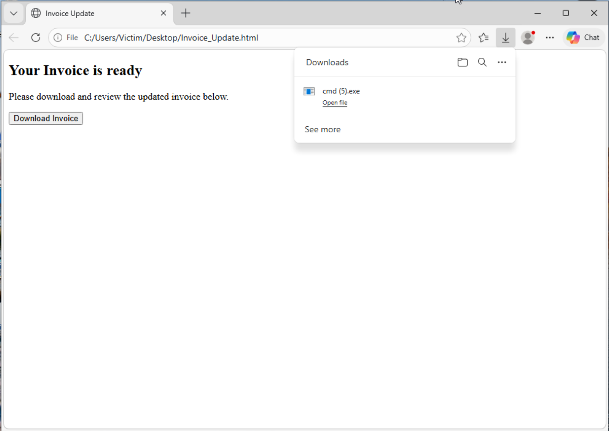
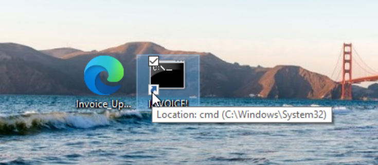
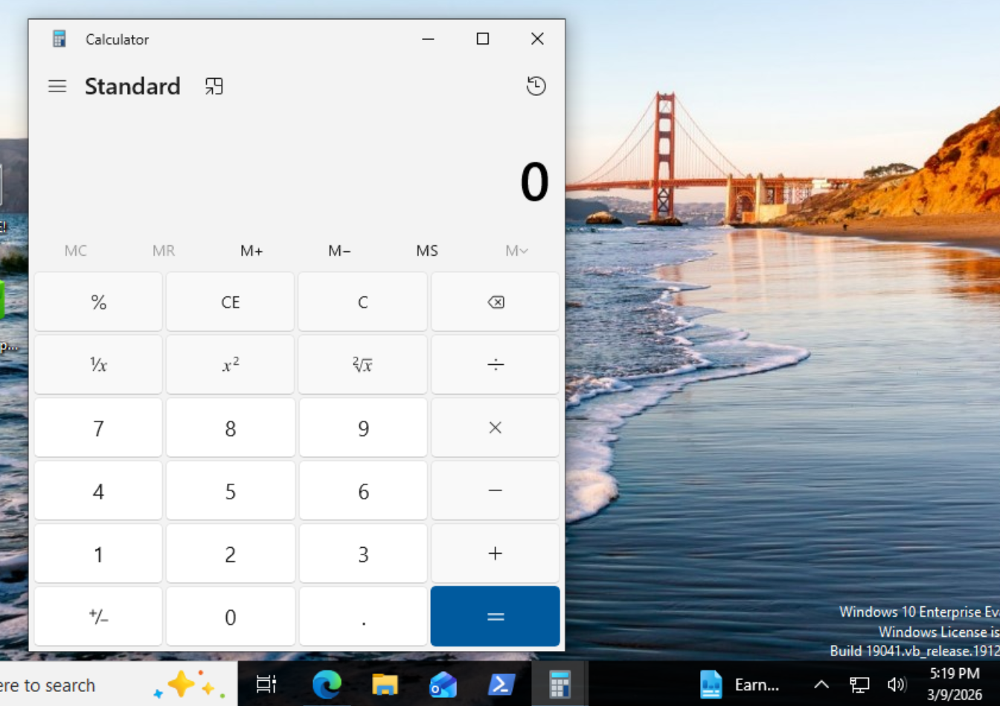
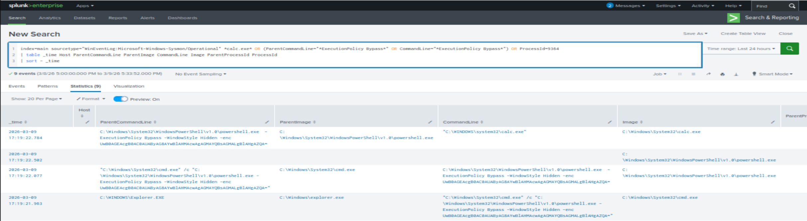
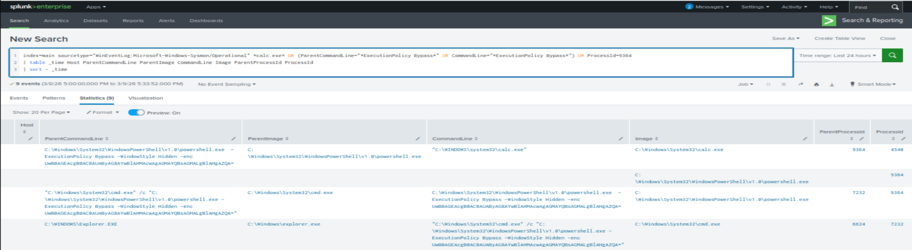

# Malicious LNK Execution

## Scenario Overview

This scenario simulates a malicious Windows shortcut (LNK) file delivered through a phishing-style HTML page. When the user downloads and executes the shortcut, it launches a command chain that ultimately runs a payload.

The goal of this exercise was to observe how user execution appears in endpoint telemetry and investigate the activity using Splunk.

## Attack Flow

HTML lure page  
→ User downloads malicious LNK file  
→ LNK executes cmd.exe  
→ cmd.exe launches powershell.exe with ExecutionPolicy bypass  
→ PowerShell launches calc.exe

## Detection Investigation

The activity was investigated using Splunk by analyzing Sysmon Event ID 1 (Process Creation).

The process chain observed:
explorer.exe
→ cmd.exe
→ powershell.exe
→ calc.exe

Indicators of suspicious behavior included:

- PowerShell execution with `ExecutionPolicy Bypass`
- Hidden PowerShell window execution
- Unusual process parent-child relationships

## Evidence

### 1. Phishing HTML Lure

The attack begins with a phishing-style HTML page designed to trick the user into downloading a malicious file.

This page mimics a legitimate document or invoice download to encourage the user to open the file.

---

### 2. Malicious LNK Execution

When the victim downloads and executes the shortcut file, it launches a command on the system.

The malicious shortcut is configured to execute a command that launches a payload when opened.

Additional execution evidence:

This demonstrates how a simple shortcut file can execute commands on the system once triggered by the user.

---

### 3. Process Chain Detection

Endpoint telemetry reveals the process chain created during execution.

Security monitoring tools allow analysts to observe how the malicious shortcut spawns additional processes.

Further investigation confirms the full process tree.

---

## Investigation Conclusion

This investigation demonstrates how a malicious Windows shortcut can be used as an initial access technique. A phishing-style HTML lure leads the user to download and execute a malicious LNK file, which then triggers command execution on the system.

By reviewing endpoint telemetry and process chain data, analysts can reconstruct the attack sequence and identify suspicious behavior associated with user-driven malware execution.
