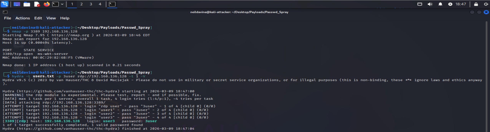
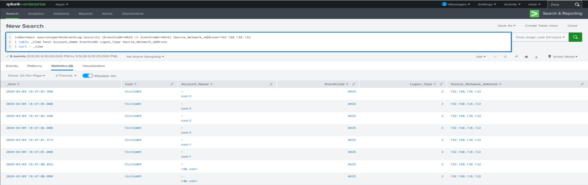
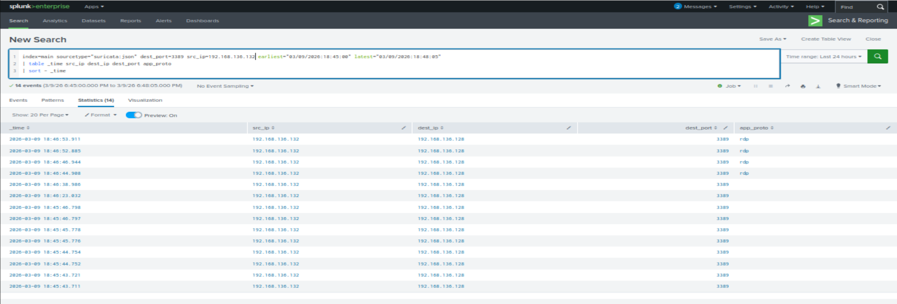
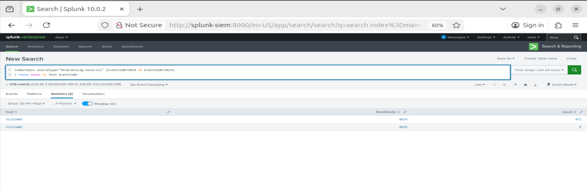

# RDP Authentication Activity

## Scenario Overview

This investigation simulates an attacker attempting to authenticate to a Windows system using Remote Desktop Protocol (RDP). RDP is commonly targeted by attackers attempting credential access or lateral movement within a network.

The goal of this simulation is to observe how RDP authentication attempts appear in endpoint logs and network telemetry, and how a SOC analyst can identify and investigate this activity using SIEM analysis.

---

## Attack Flow

1. The attacker system (Kali Linux) initiates an RDP authentication attempt against the Windows endpoint.
2. The Windows system records authentication events in the Windows Security Event Log.
3. Network traffic related to the RDP connection is observed by the Suricata/Zeek network sensor.
4. Endpoint and network logs are forwarded to Splunk.
5. The activity is investigated using SIEM queries and log correlation.

---

## Detection & Investigation

The investigation focuses on identifying authentication activity associated with RDP connections.

Windows logs record authentication attempts using Event IDs such as:

• **4624** – Successful logon  
• **4625** – Failed logon attempt

These events provide visibility into login attempts, source systems, and authentication outcomes.

## Evidence

### 1. RDP Connection Attempt from Kali

The attacker system attempted to initiate an RDP connection to the Windows victim machine.

---

### 2. Windows Authentication Events

Windows Security logs show multiple authentication attempts recorded by Event IDs 4624 and 4625.

These events indicate both successful and failed authentication attempts originating from the attacker IP address.

---

### 3. Network Telemetry (Suricata)

Network monitoring detected RDP traffic between the attacker and the victim system.

Key indicators:

• Source IP: 192.168.136.132  
• Destination Port: 3389  
• Protocol: RDP  

---

### 4. Authentication Event Summary

Splunk aggregation shows the number of authentication events observed during the activity.

