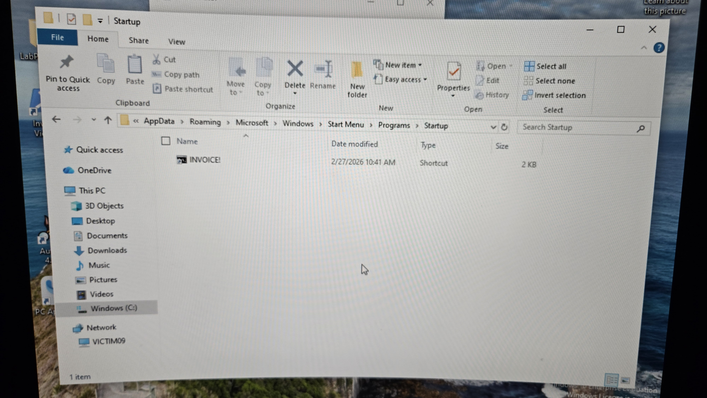
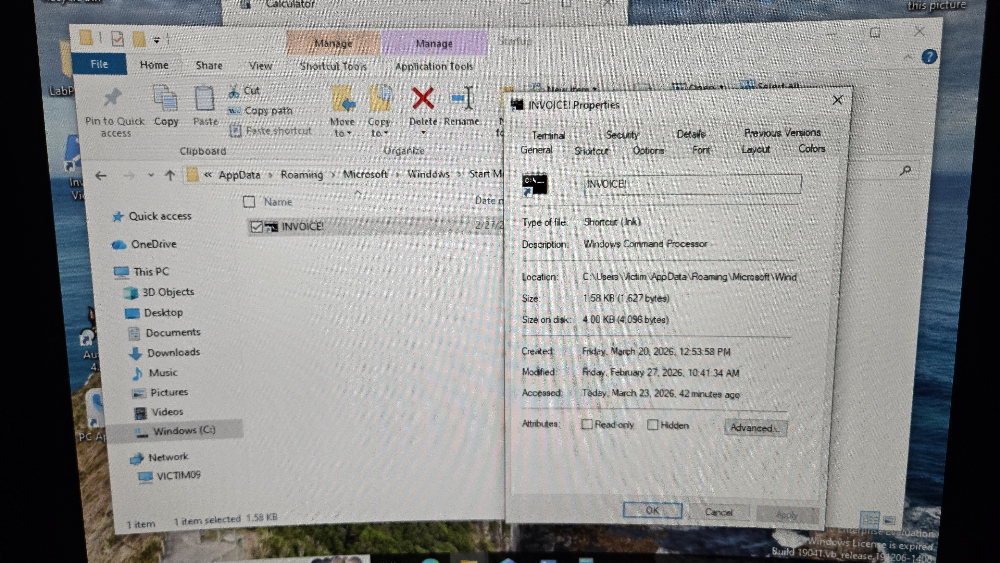
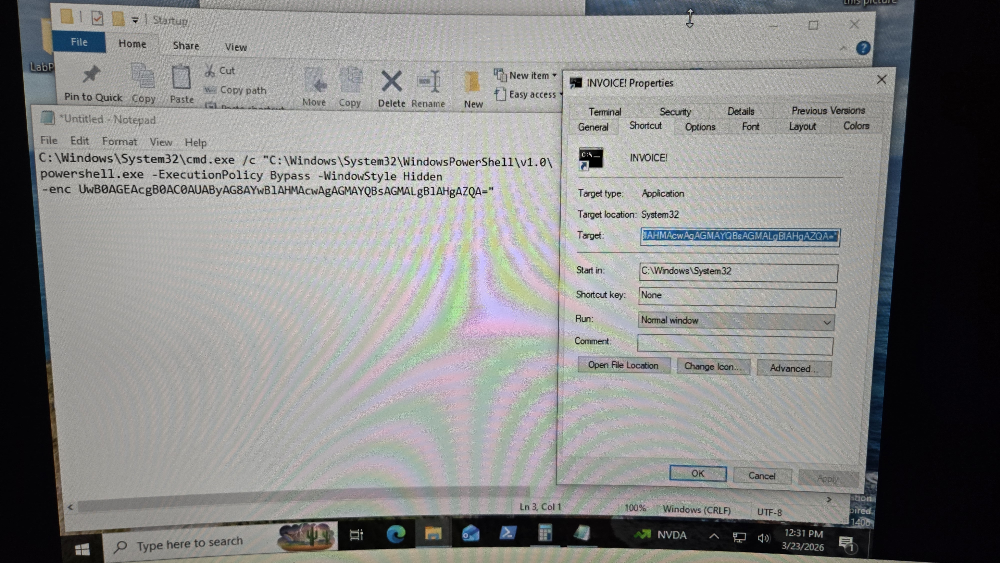
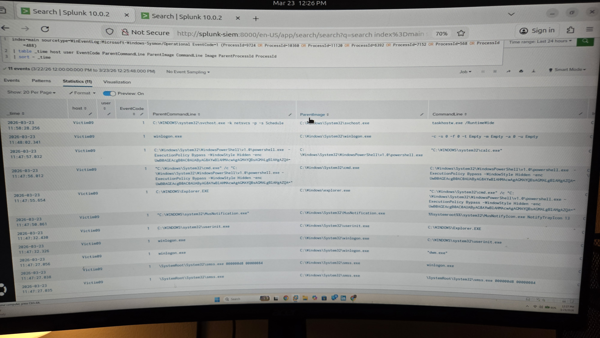
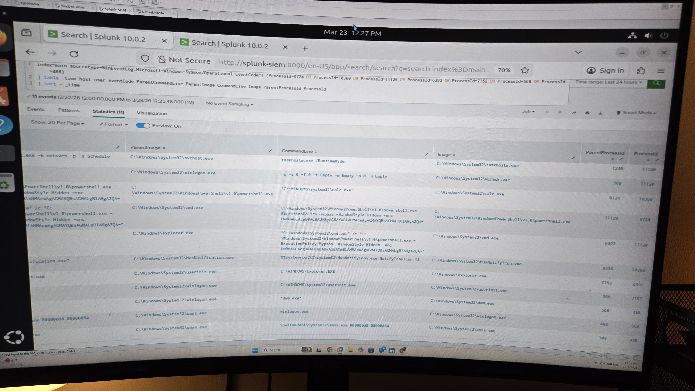

# Startup Folder Persistence

## Scenario Overview

This scenario simulates a persistence technique in which a malicious Windows shortcut (`.lnk`) file is placed in the Startup folder so it executes automatically when the user logs in. The shortcut launches `cmd.exe`, which then starts PowerShell with an encoded command.

The goal of this exercise was to observe how Startup folder persistence appears in endpoint telemetry and investigate the resulting activity using Splunk.

## Attack Flow

1. A malicious `.lnk` file is placed in the user's Startup folder.
2. When the user logs in, the shortcut is triggered automatically.
3. The shortcut launches `cmd.exe`.
4. `cmd.exe` starts `powershell.exe` with an encoded command.
5. The activity is captured by Sysmon and forwarded to Splunk.
6. The process chain is investigated through SIEM analysis.

## Detection Investigation

The activity was investigated using Splunk by analyzing Sysmon Event ID 1 (Process Creation).

The process chain observed:

- `explorer.exe`
  - `cmd.exe`
    - `powershell.exe`

Indicators of suspicious behavior included:

- Execution from the Startup folder
- Shortcut based persistence
- `cmd.exe` spawning PowerShell
- Encoded PowerShell command execution
- Unusual parent child process relationships at user logon

## Evidence

### 1. Startup Folder Artifact

The malicious shortcut was placed in the Windows Startup folder to establish persistence at user logon.

This shows the `.lnk` file stored in the Startup folder, where it will execute automatically when the user signs in.

---

### 2. Shortcut File Properties

The shortcut file properties identify the file as a Windows shortcut located in the Startup folder.

This helps confirm the persistence mechanism and where the artifact was planted.

---

### 3. Shortcut Target Command

The shortcut target reveals that it launches `cmd.exe`, which then executes PowerShell with an encoded command.

This confirms that the shortcut was configured to trigger command execution rather than open a normal file or application.

---

### 4. Splunk Process Tree Detection

Endpoint telemetry in Splunk shows the process chain created when the persistence mechanism was triggered.

This evidence shows the relationship between the parent and child processes involved in the execution chain.

---

### 5. Splunk Process Tree Continued

Additional Splunk evidence confirms the full sequence of execution and helps reconstruct the behavior.

This demonstrates how Sysmon and Splunk can be used to trace persistence activity from initial trigger to command execution.

## Investigation Conclusion

This investigation demonstrates how a malicious shortcut placed in the Startup folder can be used as a persistence technique. By reviewing Startup folder artifacts, shortcut properties, target commands, and Sysmon process creation logs in Splunk, analysts can identify and reconstruct persistence activity tied to user logon behavior.
